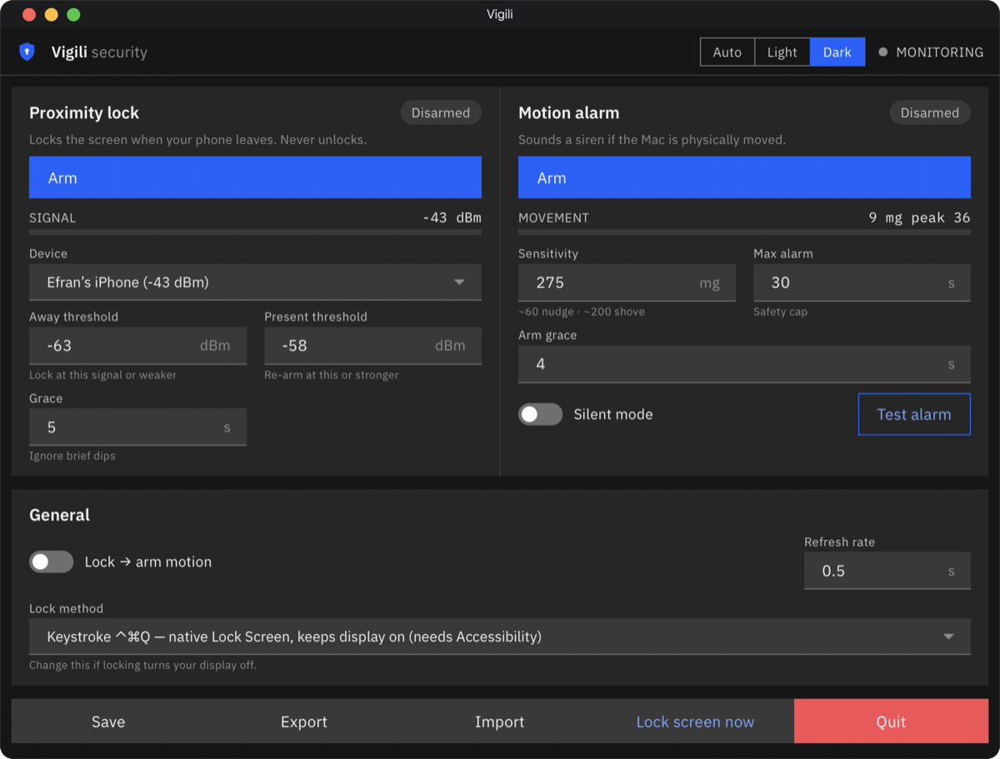

<div align="center">


# Vigili

**Auto-lock your Mac when you walk away — and sound an alarm if someone moves it.**

A tiny macOS security app for Apple-silicon Macs. Two guards in one:

🔒 **Proximity lock** — locks the screen when your paired phone/AirPods go out of
Bluetooth range, re-arms when you're back. *It never unlocks (by design).*
🚨 **Motion alarm** — a menu-bar tripwire that blares a siren if the Mac is
physically moved while armed, using the built-in accelerometer.



</div>

> ⚠️ **Honest caveats up front.** Vigili leans on macOS internals: a private
> lock call, CoreBluetooth, and an *undocumented* accelerometer. It works today
> on an M1 Pro / macOS 27, but a macOS update could break parts of it — those
> spots are flagged throughout. It only ever **locks**, never unlocks (macOS
> doesn't allow third-party unlock — see [below](#why-it-cant-auto-unlock)).

---

## Install (no Terminal needed)

1. **Download** this project — green **Code ▸ Download ZIP** button on GitHub —
   and unzip it. (Or `git clone`.)
2. Open the `vigili` folder and **double-click `Install Vigili.command`**.
   - First time only: **right-click it ▸ Open ▸ Open** (it's not from the App
     Store, so macOS asks once).
   - It sets up a private Python environment, builds the app + icon, and pops a
     "Vigili is ready!" dialog. Takes ~1 minute.
3. **Double-click `Vigili.app`.** Done — the control panel opens.

> Needs Python 3 (macOS ships it, or run `xcode-select --install` once).

---

## Using it

Everything is in one window. **Hover any control for a plain-English tooltip.**

### 🔒 Proximity lock (works right away, no password)
1. Pair your phone in **System Settings ▸ Bluetooth** first — that's what lets
   macOS recognize it (Bluetooth devices hide behind rotating addresses; pairing
   de-anonymizes yours).
2. In Vigili, pick your phone from the **Device** dropdown.
3. Click **Arm**. It now locks the screen when you leave and re-arms when you're
   back. The **Signal** meter shows your phone's live signal.

**Tuning (do a walk test):** watch the **Signal** number, walk to the spot where
you want it to lock, note the value there, and set:
- **Away (dBm)** — lock when the signal drops to this or **weaker** (more
  negative = farther). Set it a few dB above your "lock here" reading.
- **Present (dBm)** — after a lock, count you as "back" when the signal recovers
  to this or **stronger**. Keep it clearly stronger (less negative) than Away —
  the gap between the two stops it flickering.
- **Grace (s)** — how long the signal must stay "away" before locking. Ignores
  brief Bluetooth dips so it won't lock while you're sitting there.

> 💡 Bluetooth signal is noisy and dips even while you're at the desk. Don't set
> Away off a single reading — do the walk test.

### 🚨 Motion alarm (one click + your password)
The accelerometer is root-only on macOS, so in the Motion Alarm section click
**Enable…**. macOS shows its standard **password / Touch ID** prompt once, and
Vigili starts a tiny background helper that reads *only* the sensor as root — the
app itself stays unprivileged (so Bluetooth keeps working). Then **Arm** it.

Moving the Mac past the **Threshold (mg)** starts a siren; it auto-disarms when
you unlock the screen, with a **Max alarm (s)** safety cap. **Silent mode** shows
an on-screen alert instead of the siren (great for testing). **Test alarm** fires
a 3-second check.

> The helper stops itself the moment Vigili quits — it never lingers as a rogue
> root process. Prefer the old way? `sudo -E .venv/bin/python3 vigili.py` still
> works and skips the helper.

> Threshold guide: ~**60 mg** = a firm nudge, ~**200 mg** = a real shove.

### 🔗 Tie them together
Turn on **Lock ⇒ arm motion**: when the screen locks (e.g. the proximity lock
fires), the motion alarm auto-arms; unlocking auto-disarms it.

### 💾 Settings
Everything auto-saves to `~/.config/vigili/vigili.json` and loads on launch. The
**Settings** row adds explicit **Save**, **Export…** (back up to a file), and
**Import…** (load a file — bad values fall back to safe defaults).

---

## Why it can't auto-unlock

A few people ask. **macOS deliberately blocks any third-party app from unlocking
the login window** — there's no API to dismiss it, and it won't accept
synthesized keystrokes (it runs in a separate security context). The only
sanctioned proximity-unlock is Apple's **Auto Unlock with Apple Watch**
(System Settings ▸ Touch ID & Password). Faking it (storing your password +
auto-typing it) is both blocked *and* a security hole, so Vigili stays lock-only.
Use **Touch ID** or **Apple Watch** for fast re-entry.

---

## How it works (and what could break)

| Part | Mechanism | Fragility |
|---|---|---|
| Lock | Private `SACLockScreenImmediate()` in `login.framework` (the classic `CGSession` binary is gone on modern macOS) | Undocumented symbol; falls back to screen-saver / display-sleep if it ever vanishes |
| Proximity | **CoreBluetooth** passive scan — pairing lets macOS resolve the device by name with a live dBm RSSI | Needs the app's **Bluetooth** permission (macOS prompts once) |
| Motion | [`macimu`](https://pypi.org/project/macimu/) reads the undocumented SPU accelerometer (`AppleSPUHIDDevice`, Bosch IMU) over IOKit HID — **M1 Pro/Max/Ultra and later only**, not base M1 | 100% private API; a macOS report-layout change makes it inert. Fails **visibly** ("SENSOR FAILED"), never silently |

Live values refresh **even while a menu or field is open** (Vigili schedules its
timer in `NSRunLoopCommonModes`, which normal menu-bar apps don't).

---

## For developers / power users

```bash
python3 -m venv .venv && ./.venv/bin/pip install -r requirements.txt

./.venv/bin/python3 vigili.py             # window GUI (proximity)
sudo -E ./.venv/bin/python3 vigili.py     # window GUI, both halves
./.venv/bin/python3 vigili.py --menubar   # menu-bar app instead of a window
```

The window is an **IBM Carbon** UI (IBM Plex, Blue 60, square controls) rendered
in a **WKWebView** — dark by default; `VIGILI_THEME=light` / `=system` to change.
If you run it with your own `python` (not the venv), install the extra dep once:
`pip install pyobjc-framework-WebKit` (the installer already does this).

Architecture: one shared `VigiliCore` (UI-agnostic logic) with two thin front
ends — a Carbon WKWebView window (JS ↔ Python bridge) + a rumps menu bar. The two
halves are also runnable as standalone tools:

```
vigili.py              Combined app (window + menu bar) — start here
proximity_lock.py     Standalone CoreBluetooth proximity lock  (--menubar, --scan, --calibrate, --monitor)
motion_alarm.py       Standalone accelerometer siren (menu bar) (--check, --silent, --arm-on-lock)
motion_helper.py      Tiny root-only sensor helper the GUI launches via the admin prompt
tools/make_icon.py    Regenerates the app icon
setup.py              py2app config for the standalone Vigili.app
tools/build_app.sh    Builds the standalone Vigili.app (py2app)
Install Vigili.command Non-technical one-click setup
```

Config lives in `~/.config/vigili/` (written owner-only, `0600`; owned by your
real user even under sudo). A corrupt config self-heals to safe defaults.

**Standalone app:** `bash tools/build_app.sh` bundles a real, self-contained
`Vigili.app` with **py2app** — its own embedded Python + pyobjc, ad-hoc signed —
so it runs without the project folder or a `.venv`, and shows up as **Vigili**
(not "Python") in the menu bar and Force-Quit. The root motion helper still runs
under the system `python3` by design (the accelerometer is root-only and the
admin prompt spawns a clean shell), so `motion_helper.py` and a `macimu` source
copy ride along inside the app for that helper to use — see `resource_base()` /
`_stage_root_helper` in `vigili.py`.

---

## Requirements
- Apple-silicon Mac (proximity: any; **motion: M1 Pro/Max/Ultra or later**)
- macOS 12+ (developed/verified on macOS 27)
- Python 3

## License
MIT — see [LICENSE](LICENSE).
